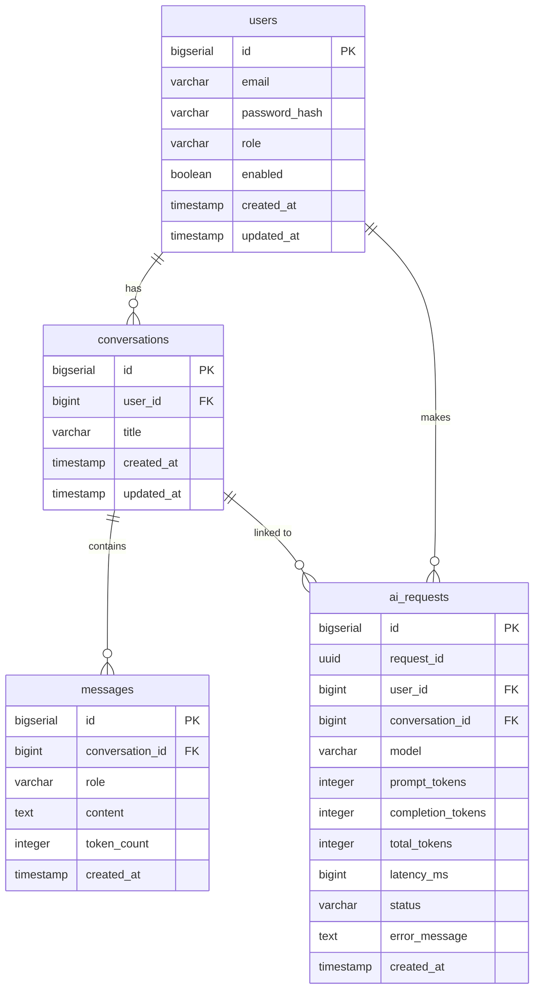

# AI Gateway

## Project Overview

AI Gateway là một backend REST API service được xây dựng bằng Spring Boot, đóng vai trò là gateway trung gian cho các AI request.

Dự án hiện đã hoàn thành các module **Authentication, Conversation, AI Chat & Rate Limiting**:

- Authentication flow (Register, Login, Refresh Token, Logout) đã được implement
- JWT-based stateless authentication với Refresh Token rotation qua Redis
- AI Chat sử dụng mô hình LLM từ Groq (chuyển đổi từ OpenAI)
- Conversation & Message history management
- Fixed-window Rate Limiting cho API Chat qua Redis
- Lưu vết AI Requests và Token Usage
- Database schema đã tạo đầy đủ (users, conversations, messages, ai_requests)

## Tech Stack

| Layer | Technology | Version |
|-------|-----------|---------|
| Language | Java | 17 |
| Framework | Spring Boot | 4.1.1 |
| Web | Spring MVC (spring-boot-starter-webmvc) | 4.1.1 |
| Security | Spring Security | (managed by Spring Boot) |
| ORM | Spring Data JPA / Hibernate | (managed by Spring Boot) |
| Database | PostgreSQL | 16 (Docker) |
| Migration | Flyway + flyway-database-postgresql | (managed by Spring Boot) |
| Cache / Token Store | Redis | 7 (Docker) |
| JWT | jjwt (io.jsonwebtoken) | 0.12.6 |
| Validation | Spring Validation (jakarta.validation) | (managed by Spring Boot) |
| Build | Maven | — |
| Boilerplate | Lombok | (optional, annotation processor) |
| Monitoring | Spring Actuator | (managed by Spring Boot) |
| LLM Provider| Groq API | (llama-3.3-70b-versatile) |

> **Không có:** Swagger/OpenAPI, Docker Compose cho ứng dụng (chỉ có cho PostgreSQL và Redis), Kafka, RabbitMQ.

---

## Architecture

### Layered Architecture

```
Client (HTTP)
    │
    ▼
JwtAuthenticationFilter          ← Validates Bearer token on every request
    │
    ▼
AuthController                   ← Thin layer: validate input, call service, return response
    │
    ▼
AuthService                      ← Business logic: register, login, refresh, logout
    │              │
    ▼              ▼
UserRepository  RefreshTokenService   ← Redis operations (create, validate, rotate, delete)
    │              │
    ▼              ▼
PostgreSQL       Redis
```

### Authentication Flow

```
POST /register
  → BCrypt hash password
  → Save user to PostgreSQL
  → Return UserResponse (201)

POST /login
  → Find user by email
  → Check enabled
  → BCrypt.matches()
  → Generate Access Token (JWT, 15 min)
  → Generate Refresh Token (opaque, stored in Redis, 7 days)
  → Return AuthResponse

POST /refresh
  → Validate Refresh Token exists in Redis
  → Delete old Refresh Token (rotation)
  → Generate new Access Token
  → Generate new Refresh Token
  → Return AuthResponse

POST /logout  [requires Bearer token]
  → Delete Refresh Token from Redis
  → Return 204 No Content
```

### JWT Access Token Payload

```json
{
  "sub": "1",
  "userId": 1,
  "email": "user@example.com",
  "role": "USER",
  "iat": 1727180000,
  "exp": 1727180900
}
```

### Redis Refresh Token

```
Key:   auth:refresh:{userId}:{tokenId}
Value: "active"
TTL:   604800 seconds (7 days)
```

---

## Database Schema

> Schema từ Flyway migration `V1__init_schema.sql`. Không được tự ý thêm/xóa column.

### Tables

#### `users`

| Column | Type | Constraints |
|--------|------|-------------|
| id | BIGSERIAL | PRIMARY KEY |
| email | VARCHAR(255) | NOT NULL, UNIQUE |
| password_hash | VARCHAR(255) | NOT NULL |
| role | VARCHAR(50) | NOT NULL, DEFAULT 'USER', CHECK IN ('USER', 'ADMIN') |
| enabled | BOOLEAN | NOT NULL, DEFAULT TRUE |
| created_at | TIMESTAMP | NOT NULL, DEFAULT CURRENT_TIMESTAMP |
| updated_at | TIMESTAMP | NOT NULL, DEFAULT CURRENT_TIMESTAMP |

#### `conversations`

| Column | Type | Constraints |
|--------|------|-------------|
| id | BIGSERIAL | PRIMARY KEY |
| user_id | BIGINT | NOT NULL, FK → users(id) ON DELETE CASCADE |
| title | VARCHAR(255) | nullable |
| created_at | TIMESTAMP | NOT NULL |
| updated_at | TIMESTAMP | NOT NULL |

#### `messages`

| Column | Type | Constraints |
|--------|------|-------------|
| id | BIGSERIAL | PRIMARY KEY |
| conversation_id | BIGINT | NOT NULL, FK → conversations(id) ON DELETE CASCADE |
| role | VARCHAR(20) | NOT NULL, CHECK IN ('SYSTEM', 'USER', 'ASSISTANT') |
| content | TEXT | NOT NULL |
| token_count | INTEGER | nullable |
| created_at | TIMESTAMP | NOT NULL |

#### `ai_requests`

| Column | Type | Constraints |
|--------|------|-------------|
| id | BIGSERIAL | PRIMARY KEY |
| request_id | UUID | NOT NULL, UNIQUE |
| user_id | BIGINT | NOT NULL, FK → users(id) ON DELETE CASCADE |
| conversation_id | BIGINT | nullable, FK → conversations(id) ON DELETE SET NULL |
| model | VARCHAR(100) | NOT NULL |
| prompt_tokens | INTEGER | nullable |
| completion_tokens | INTEGER | nullable |
| total_tokens | INTEGER | nullable |
| latency_ms | BIGINT | nullable |
| status | VARCHAR(30) | NOT NULL, CHECK IN ('SUCCESS', 'FAILED', 'TIMEOUT') |
| error_message | TEXT | nullable |
| created_at | TIMESTAMP | NOT NULL |

### ERD (simplified)



---

## API Endpoints

### Implemented

| Method | Endpoint | Auth | Status Code | Description |
|--------|----------|------|-------------|-------------|
| POST | `/api/v1/auth/register` | Public | 201 Created | Register new user |
| POST | `/api/v1/auth/login` | Public | 200 OK | Login, returns JWT + refresh token |
| POST | `/api/v1/auth/refresh` | Public | 200 OK | Rotate refresh token, returns new tokens |
| POST | `/api/v1/auth/logout` | Bearer JWT | 204 No Content | Invalidate refresh token |
| POST | `/api/v1/ai/chat` | Bearer JWT | 200 OK | Gửi tin nhắn AI Chat, kèm Rate Limiting (429) |

### Request / Response

#### POST `/api/v1/auth/register`

Request:
```json
{
  "email": "user@example.com",
  "password": "Password123"
}
```

Response `201`:
```json
{
  "id": 1,
  "email": "user@example.com",
  "role": "USER",
  "enabled": true
}
```

#### POST `/api/v1/auth/login`

Request:
```json
{
  "email": "user@example.com",
  "password": "Password123"
}
```

Response `200`:
```json
{
  "accessToken": "eyJhbGciOiJIUzI1NiJ9...",
  "refreshToken": "1:550e8400-e29b-41d4-a716-446655440000",
  "tokenType": "Bearer",
  "expiresIn": 900
}
```

#### POST `/api/v1/auth/refresh`

Request:
```json
{
  "refreshToken": "1:550e8400-e29b-41d4-a716-446655440000"
}
```

Response `200`: same structure as login response, with new tokens.

#### POST `/api/v1/auth/logout`

Header: `Authorization: Bearer <accessToken>`

Request:
```json
{
  "refreshToken": "1:550e8400-e29b-41d4-a716-446655440000"
}
```

Response `204 No Content`

### Error Response Format

```json
{
  "timestamp": "2026-09-26T13:00:00Z",
  "status": 401,
  "error": "Unauthorized",
  "message": "Invalid credentials",
  "path": "/api/v1/auth/login"
}
```

| Scenario | HTTP Status |
|----------|-------------|
| Duplicate email on register | 409 Conflict |
| Wrong email or password | 401 Unauthorized |
| Invalid / expired refresh token | 401 Unauthorized |
| Vượt quá giới hạn Rate Limit (Chat) | 429 Too Many Requests |
| Validation error (blank field, bad email format, short password) | 400 Bad Request |
| Server error | 500 Internal Server Error |

---

## How to Run

### Prerequisites

- Java 17
- Maven
- Docker (for PostgreSQL and Redis)

### 1. Clone repository

```bash
git clone <repository-url>
cd ai-gateway
```

### 2. Configure environment variables

```bash
cp .env.example .env
# Edit .env and set JWT_SECRET to a long random string
```

### 3. Start required services (PostgreSQL + Redis)

```bash
docker-compose up -d
```

This starts:
- PostgreSQL 16 on port `5432`, database `ai_gateway`
- Redis 7 on port `6379`

### 4. Run application

On Windows (if default JAVA_HOME is not Java 17):
```powershell
$env:JAVA_HOME = "C:\Program Files\Java\jdk-17"
$env:PATH = "$env:JAVA_HOME\bin;$env:PATH"
mvn spring-boot:run
```

On Linux/macOS with Java 17 set as default:
```bash
mvn spring-boot:run
```

Application starts on: `http://localhost:8080`

Flyway migrations run automatically on startup and create all required tables.

### 5. Run tests

```powershell
$env:JAVA_HOME = "C:\Program Files\Java\jdk-17"
mvn clean test
```

> **Note:** `AuthControllerTest` currently has a compilation issue related to `@WebMvcTest` not being available in Spring Boot 4.1.1. `AuthServiceTest` (pure Mockito unit tests) should pass.

---

## Environment Variables

| Variable | Required | Default (dev only) | Description |
|----------|----------|--------------------|-------------|
| `JWT_SECRET` | **Yes** (production) | `default-dev-secret-change-this-in-production-must-be-at-least-32-chars` | HMAC-SHA signing key cho JWT. |
| `GROQ_API_KEY` | **Yes** | (none) | API Key để gọi tới Groq LLM API. |

> Database host/port/credentials are currently hardcoded in `application.yaml` as `localhost:5432`, user `postgres`, password `postgres`.
> Redis host/port are currently hardcoded as `localhost:6379`.
>
> These are suitable for local development only. For production, externalize these via environment variables or a secrets manager.

---

## Known Limitations

**Authentication:**
- No email verification flow after registration
- No password reset / forgot password feature
- No rate limiting on login endpoint (brute force not prevented)
- Access Token cannot be revoked before expiry (no token blacklist) — only Refresh Token can be revoked via logout

**Test:**
- Chưa có integration tests hoàn chỉnh đối với PostgreSQL hoặc Redis (chỉ sử dụng e2e test script bằng PowerShell).

**Configuration:**
- Database credentials (`postgres`/`postgres`) are hardcoded in `application.yaml` — not suitable for production.
- Redis has no password configured in `docker-compose.yml` hoặc `application.yaml`.

---

## AI Usage

AI tools were used during development for architecture discussion, implementation assistance, debugging, testing guidance, and documentation.

For a detailed development history, see:

[AI Worklog](./AI_WORKLOG.md)
