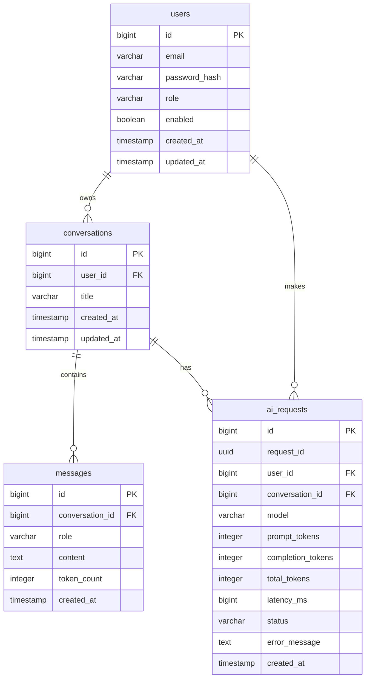

# AI Gateway

AI Gateway is a Spring Boot application acting as an intelligent proxy between clients and external Large Language Model (LLM) APIs (like OpenAI, Groq). It provides a secure, reliable, and scalable infrastructure for AI applications.

## Features Completed (Day 1 - 4)

* **Authentication:** Registration, Login, Logout using Bearer JWT.
* **JWT Access Token:** Securely authenticated endpoints using Spring Security.
* **Refresh Token + Redis:** Long-lived sessions utilizing Redis to store and invalidate refresh tokens.
* **LLM Integration:** Pluggable architecture currently supporting Groq API (`qwen/qwen3.8-27b`).
* **Conversation Management:** Grouping messages into conversational threads (`/conversations`).
* **Message History:** Persisting and retrieving chat context.
* **AI Request Logging:** Storing execution details of every LLM request.
* **Token Usage:** Tracking tokens consumed by users (`/usage`).
* **Redis Rate Limiting:** Throttling user requests to prevent abuse.
* **Reliability Features:**
  * Request ID generation for traceability
  * Comprehensive Logging
  * Read/Connect Timeout handling for external LLMs
  * Retry mechanism for resilient LLM communication
  * Global Exception Handling mapping to standardized error JSONs
* **Swagger/OpenAPI:** Auto-generated interactive API documentation at `/swagger-ui/index.html`.
* **Postman:** Ready-to-use API endpoints layout.
* **Docker & Deployment:** Multi-stage Dockerfile and Docker Compose setup for instant deployment alongside PostgreSQL and Redis.

## Architecture

The following diagram illustrates the actual implementation architecture of the AI Gateway:

```mermaid
graph TD
    Client[Client] -->|HTTP| API[Spring Boot API]
    API -->|Validates| JWT[JWT Authentication]
    JWT -->|Rate limit check| Redis[(Redis)]
    
    Redis -->|Pass| AIService[AI Service]
    
    AIService -->|API Request| LLM[LLM Provider]
    LLM -->|External Call| ExtLLM[External LLM API (Groq)]
    
    AIService -->|Read/Write| DB[(PostgreSQL)]
    DB --> Users
    DB --> Conversations
    DB --> Messages
    DB --> AI_Requests[AI Request / Usage]
    
    subgraph Reliability Mechanisms
        ReqID[Request ID generation]
        Log[Detailed Request Logging]
        Timeout[LLM Timeout Handling]
        Retry[Automated Retries]
        ExHandler[Global Exception Handling]
    end
```

## Database Schema

The entity relationship diagram based on the actual PostgreSQL Flyway migrations:



## Getting Started

**Prerequisites:** Docker, Docker Compose

1. Clone the repository.
2. Ensure you have copied `.env.example` to `.env` and populated your API keys.
3. Run the application:
```bash
docker-compose up --build -d
```
4. Access the API documentation at `http://localhost:8080/swagger-ui/index.html`.
