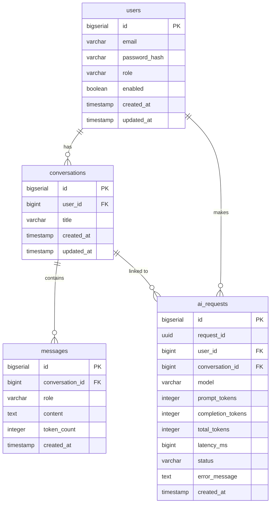

# AI Gateway

## Project Overview

AI Gateway là một backend REST API service được xây dựng bằng Spring Boot, đóng vai trò là gateway trung gian cho các AI request.

Dự án hiện đã hoàn thành các tính năng:
- Authentication (Register, Login)
- JWT-based stateless authentication
- Refresh Token rotation qua Redis
- LLM integration sử dụng Groq API (model llama-3.3-70b-versatile)
- Conversation & Message history management
- Ghi nhận AI request logging và Token usage
- Cấu hình Timeout và Retry mechanism cho external calls
- Fixed-window Redis Rate Limiting cho API AI Chat (giới hạn theo User)
- Cơ chế Request Tracing xuyên suốt bằng UUID (Request ID)
- Cấu trúc Global Exception Handling chuẩn hóa

---

## Tech Stack

| Layer | Technology | Version |
|-------|-----------|---------|
| Language | Java | 17 |
| Framework | Spring Boot | 4.1.1 |
| Web | Spring MVC (spring-boot-starter-webmvc) | 4.1.1 |
| Security | Spring Security | (managed by Spring Boot) |
| ORM | Spring Data JPA / Hibernate | (managed by Spring Boot) |
| Database | PostgreSQL | 16 (Docker) |
| Migration | Flyway + flyway-database-postgresql | (managed by Spring Boot) |
| Cache / Token Store | Redis | 7 (Docker) |
| JWT | jjwt (io.jsonwebtoken) | 0.12.6 |
| Validation | Spring Validation (jakarta.validation) | (managed by Spring Boot) |
| Build | Maven | — |
| Boilerplate | Lombok | (optional, annotation processor) |
| LLM Provider| Groq API | (llama-3.3-70b-versatile) |

---

## Architecture

### System Flow

```text
Client (HTTP)
   ↓
Security / JWT (JwtAuthenticationFilter)
   ↓
Request ID Filter (RequestLoggingFilter)
   ↓
Rate Limit (RateLimitService - Redis)
   ↓
AI Controller (AuthController / AiController)
   ↓
AI Service
   ↓
LLM Provider (GroqLlmProvider)
   ↓
Retry / Timeout Handling (LlmConfig)
   ↓
LLM API (Groq)
   ↓
Response
   ↓
Conversation / Message Persistence
   ↓
AI Request Log / Token Usage Persistence
```

### Error Flow

```text
Exception Thrown
   ↓
GlobalExceptionHandler (hoặc qua DelegatedAuthenticationEntryPoint/DelegatedAccessDeniedHandler)
   ↓
Standard Error Response (JSON)
   ↓
Attach Request ID
   ↓
Client
```

---

## Database Schema

> Schema từ Flyway migration `V1__init_schema.sql`.

### ERD (simplified)



---

## API Endpoints

### Authentication

| Method | Endpoint | Auth | Status Code | Description |
|--------|----------|------|-------------|-------------|
| POST | `/api/v1/auth/register` | Public | 201 Created | Đăng ký người dùng mới |
| POST | `/api/v1/auth/login` | Public | 200 OK | Đăng nhập, trả về Access Token + Refresh Token |
| POST | `/api/v1/auth/refresh` | Public | 200 OK | Refresh token (rotation), trả về token mới |
| POST | `/api/v1/auth/logout` | Bearer JWT | 204 No Content | Vô hiệu hóa Refresh Token (Logout) |

### AI

| Method | Endpoint | Auth | Status Code | Description |
|--------|----------|------|-------------|-------------|
| POST | `/api/v1/ai/chat` | Bearer JWT | 200 OK | Gửi tin nhắn đến LLM, xử lý Rate Limiting, lưu lịch sử tự động |

> Note: Conversation & Usage API có thể truy cập nội bộ thông qua Service Layer, endpoint dành cho client (VD: Lấy danh sách conversation, lấy lịch sử AI Request) chưa được thiết lập.

---

## How to Run

### Prerequisites
- Java 17
- Maven
- Docker (cho PostgreSQL và Redis)

### 1. Khởi động các dịch vụ phụ trợ (PostgreSQL + Redis)

```bash
docker-compose up -d
```
(Sẽ khởi chạy PostgreSQL ở port `5432` và Redis ở port `6379`)

### 2. Cấu hình biến môi trường
Tạo file `.env` từ `.env.example`:
```bash
cp .env.example .env
```
Cung cấp các thông tin cần thiết vào file `.env` (như `JWT_SECRET`, `GROQ_API_KEY`).

### 3. Khởi chạy ứng dụng Spring Boot

Trên Windows (PowerShell):
```powershell
$env:JAVA_HOME = "C:\Program Files\Java\jdk-17"
$env:PATH = "$env:JAVA_HOME\bin;$env:PATH"
mvn spring-boot:run
```

Trên Linux/macOS:
```bash
mvn spring-boot:run
```

Flyway migration sẽ tự động tạo bảng khi ứng dụng khởi động thành công (tại `http://localhost:8080`).

### 4. Chạy Unit & Integration Tests

```powershell
$env:JAVA_HOME = "C:\Program Files\Java\jdk-17"
$env:PATH = "$env:JAVA_HOME\bin;$env:PATH"
mvn clean test
```
Đảm bảo tất cả 52/52 tests đều chạy thành công (`BUILD SUCCESS`).

---

## Environment Variables

Các biến môi trường cần thiết được cung cấp qua file `.env`:

```env
JWT_SECRET=<your-jwt-secret>
GROQ_API_KEY=<your-groq-api-key>
```

> Các biến kết nối Database (`postgres`/`postgres` ở `localhost:5432`), Redis (`localhost:6379`) và các thông số Cấu hình AI Retry/Timeout hiện đang sử dụng mặc định trong `application.yaml` thuận tiện cho môi trường dev. Trên production, bạn có thể truyền qua các biến như `SPRING_DATASOURCE_URL`, `SPRING_DATA_REDIS_HOST`, `AI_LLM_MAX_RETRIES` v.v.

---

## Known Limitations

- Chưa cấu hình Password Policy phức tạp hoặc gửi Email xác nhận (Email Verification).
- Endpoint Logout hiện tại chỉ chặn ở Refresh Token; Access Token còn thời hạn (15 phút) vẫn có khả năng dùng tiếp (Chưa có tính năng JWT Blacklisting).
- Không có rate limiting tích hợp ở level Gateway cho Endpoint Login (Chống Brute force).

No known blocking limitations at the current development stage.

---

## Reliability

Gateway đã hoàn thành tích hợp các lớp Resilience mạnh mẽ sau:

| Feature                   | Status      |
| ------------------------- | ----------- |
| Request ID                | Implemented |
| Logging                   | Implemented |
| Timeout                   | Implemented |
| Retry                     | Implemented |
| Exception Handling        | Implemented |
| Redis Rate Limiting       | Implemented |
| Error Testing             | Passed      |
| Sensitive Data Protection | Verified    |

- **Request ID / Request Tracing**: Sinh UUID và theo dõi toàn bộ request qua MDC & HTTP Header.
- **Timeout**: Timeout connection (5s) và read timeout (30s) đảm bảo Thread an toàn.
- **Retry**: Localized Retry Mechanism với Backoff tăng dần (1s, 2s, 4s) cho các lỗi 429, 5xx, và Timeout Network.
- **Fail-fast handling**: Block lỗi Client 400s (trừ 429) và không thực hiện retry tránh tốn năng lượng.
- **Global Exception Handling**: Mapping toàn bộ Spring Exceptions, Security Exceptions, và LlmExceptions ra chuẩn JSON kèm `requestId`.
- **Redis Rate Limiting**: Limit API `/ai/chat` theo UserID với Window Time.
- **Structured Logging**: Lưu log chi tiết Duration (kể cả Fail).
- **Sensitive data protection**: Các response giấu kín tên LLM Provider (VD Groq) khi bị lỗi 500/502; API Key, password, JWT không rò rỉ qua Logs hay Exceptions.

Kiểm thử hệ thống:
```text
52/52 Unit and Integration Tests passed
BUILD SUCCESS
```

---

## AI Usage

AI was used during development for architecture discussion, implementation assistance, debugging, testing guidance, and documentation.

Detailed development history:

[AI Worklog](./AI_WORKLOG.md)
