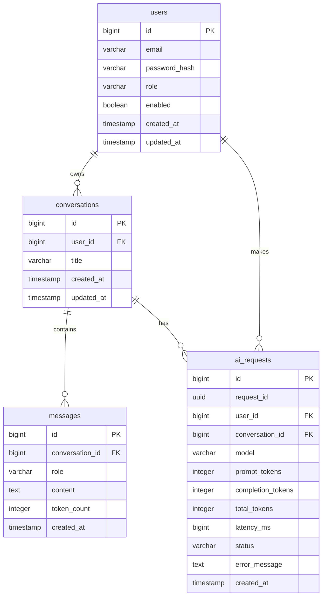

# AI Gateway

## Project Overview

AI Gateway is a Spring Boot application acting as an intelligent proxy between clients and external Large Language Model (LLM) APIs. It manages and routes AI requests while handling cross-cutting concerns.

The gateway architecture follows this pattern:
```text
Application
    ↓
AI Gateway
    ↓
LLM Provider
```

The gateway is responsible for:
* Authentication (JWT-based)
* AI request management
* Rate limiting (Redis-based)
* LLM integration (Groq / OpenAI-compatible API)
* Conversation storage
* Usage tracking
* Reliability (Retries, Timeouts)
* Error handling
* Logging

## Features

* **Authentication:** Registration, Login, Logout using Bearer JWT.
* **Refresh Token:** Session extension managed via Redis.
* **LLM Integration:** Pluggable architecture currently integrated with Groq.
* **Chat API:** Multi-turn conversation support with automatic context management.
* **Analyze API:** Synchronous structured output (JSON) for text analysis.
* **Conversation Management:** Grouping messages into conversational threads.
* **Usage Tracking:** Token usage, request count, latency, and error rate monitoring.
* **Rate Limiting:** IP/User-based throttling.
* **Reliability:** Timeout, automatic retries, and comprehensive error mapping.

## Tech Stack

* Java 17
* Spring Boot 3
* Spring Security
* Spring Data JPA
* PostgreSQL
* Flyway
* Redis
* JWT
* Groq / OpenAI-compatible API
* Docker & Docker Compose
* Maven

## Architecture

```text
Client
  ↓
Controller (REST Endpoints)
  ↓
Security / JWT (AuthenticationFilter)
  ↓
Rate Limit (Redis)
  ↓
AI Service
  ↓
LLM Provider (Groq HTTP call)
  ↓
Response
  ↓
Persistence / Usage (PostgreSQL DB)
```

**Layer Responsibilities:**
* **Controller:** Receives HTTP requests, handles DTO mapping and input validation.
* **Service:** Business logic including AI logic, rate limit enforcement, and database transaction boundaries.
* **Repository:** Data access to PostgreSQL using Spring Data JPA.
* **Security:** JWT creation, verification, and stateless session management.
* **LLM Provider:** Abstraction over external APIs, handling HTTP calls, timeouts, and JSON parsing.
* **Exception Handler:** Global `@ControllerAdvice` that translates exceptions to standardized HTTP responses.
* **Filter:** Servlet filters like `RequestLoggingFilter` for MDC request tracing.

## Request Flow

### `/ai/chat`

```text
Request
 ↓
JWT Authentication
 ↓
Rate Limit
 ↓
AI Service
 ↓
LLM Provider
 ↓
Response
 ↓
Conversation / Message (Save to DB)
 ↓
AI Request / Usage (Save Audit Log)
```

### `/ai/analyze`

```text
Request
 ↓
JWT Authentication
 ↓
Rate Limit
 ↓
AI Service
 ↓
System Prompt Construction
 ↓
LLM Provider
 ↓
Structured Output Parsing (JSON)
 ↓
AI Request / Usage (Save Audit Log)
 ↓
Response
```

## Database Schema



## API Endpoints

| Method | Endpoint | Auth | Description |
|---|---|---|---|
| POST | `/api/v1/auth/register` | No | Register a new user |
| POST | `/api/v1/auth/login` | No | Login and get access & refresh tokens |
| POST | `/api/v1/auth/refresh` | No | Refresh the access token |
| POST | `/api/v1/auth/logout` | No | Invalidate the refresh token |
| POST | `/api/v1/ai/chat` | Yes | Send a chat message and get AI response |
| POST | `/api/v1/ai/analyze` | Yes | Request structured analysis from AI |
| POST | `/api/v1/conversations` | Yes | Create a new conversation |
| GET | `/api/v1/conversations` | Yes | List user's conversations |
| GET | `/api/v1/conversations/{id}/history` | Yes | Get message history for a conversation |
| POST | `/api/v1/conversations/{id}/messages` | Yes | Add a message to an existing conversation manually |
| GET | `/api/v1/usage` | Yes | Get user's AI usage statistics |

## Authentication

Authentication is handled via **JWT (JSON Web Token)**.

```text
Login
 ↓
Access Token (short-lived, stateless)
 +
Refresh Token (long-lived, stored in Redis)
```

* **Access Token:** Bearer token sent in the `Authorization` header. Extracted by `JwtAuthenticationFilter`.
* **Refresh Token:** Used to obtain a new Access Token via the `/refresh` endpoint. Invalidation on logout is managed via Redis.
* **Bearer Authentication:** Protected API endpoints require an active Access Token.

## LLM Integration

* **Current Provider:** Groq
* **API Integration:** OpenAI-compatible REST APIs
* **Model Configuration:** Configurable default model (`qwen/qwen3.8-27b`) via environment variables.
* **Timeout:** Connection timeout at 5,000ms, read timeout at 30,000ms.
* **Retry:** Automatic retry for network errors and 5xx/429 HTTP statuses (up to 2 retries).
* **Token Usage:** Extracts token metrics directly from provider responses to store locally.
* **Structured Output:** System prompts force JSON structured output in the `/ai/analyze` endpoint.

## Rate Limiting

* **Implementation:** Redis-backed Fixed Window Strategy.
* **Key Strategy:** Limited per user ID (`ratelimit:ai:chat:user:{userId}`).
* **Limit:** 5 requests.
* **Window/TTL:** 60 seconds.
* **HTTP Response:** Returns `429 Too Many Requests` (`RateLimitExceededException`) when the limit is exceeded.

## Reliability

* **Retry:** Exponential backoff retries for transient errors.
* **Timeout:** Explicit network timeouts to prevent application freezing.
* **Exception Handling:** Global `@ControllerAdvice` handling mapping all edge cases to standard HTTP status codes (400, 401, 403, 404, 429, 502, 504).
* **Request ID:** Generated UUID per incoming request for full-stack log tracing via MDC.
* **Logging:** Structured SLF4J logs detailing latency, user, and conversation.
* **Fail-fast:** Client errors (e.g., 400 Bad Request to LLM) are immediately propagated and not retried.
* **Structured Error Response:** JSON responses containing timestamp, status, error, and path for all exceptions.

## Usage Tracking

The system tracks every interaction via the `ai_requests` table to generate statistics for `/usage`.

Metrics available:
* **requests:** Total number of API requests initiated by the user.
* **tokens:** Sum of `total_tokens` (prompt + completion) consumed by the user across all models.
* **average_latency_ms:** The arithmetic mean of time taken (in milliseconds) for the LLM to respond.
* **error_rate:** The ratio of `FAILED` or `TIMEOUT` requests over the total requests made by the user.

## How to Run

1. **Clone repository:**
   ```bash
   git clone <repository-url>
   cd ai-gateway
   ```
2. **Configure environment variables:**
   Copy `.env.example` to `.env` and fill in the required values (e.g., Database credentials, Groq API Key).
3. **Start PostgreSQL & Redis (via Docker Compose):**
   ```bash
   docker-compose up -d postgres redis
   ```
4. **Run application:**
   ```bash
   ./mvnw clean spring-boot:run
   ```
   Or run the compiled package:
   ```bash
   mvn clean package -DskipTests
   java -jar target/*.jar
   ```

To run tests:
```bash
mvn clean test
```

## Environment Variables

The application relies on `application.yaml` combined with `.env`:

* `DATABASE_URL`
* `DATABASE_USERNAME`
* `DATABASE_PASSWORD`
* `REDIS_HOST`
* `REDIS_PORT`
* `JWT_SECRET`
* `LLM_API_KEY`

## Docker

A complete `Dockerfile` (Multi-stage build) and `docker-compose.yml` are provided.

To run the entire stack (App, PostgreSQL, Redis):
```bash
docker-compose up -d --build
```
The application will be exposed on port `8080`.
Volume mounting is configured for `postgres_data` and `redis_data` to ensure data persistence across container restarts.

## API Documentation

Swagger UI is automatically configured and can be accessed at:
```text
http://localhost:8080/swagger-ui/index.html
```

## Postman

A Postman collection `AIGateway.postman_collection.json` is provided in the repository. Import this file into Postman to quickly test all available API endpoints.

## Known Limitations

* Single LLM provider (Groq) integration; no dynamic switching or fallback model yet.
* Synchronous AI processing; requests hold the HTTP thread until the LLM responds. Queue processing is not implemented.
* Token cost estimation/pricing mapping is not yet supported; only raw token counts are stored.

## AI Usage

See [AI_WORKLOG.md](AI_WORKLOG.md) for the development history, prompts, AI suggestions, verification, and issues discovered during development.
